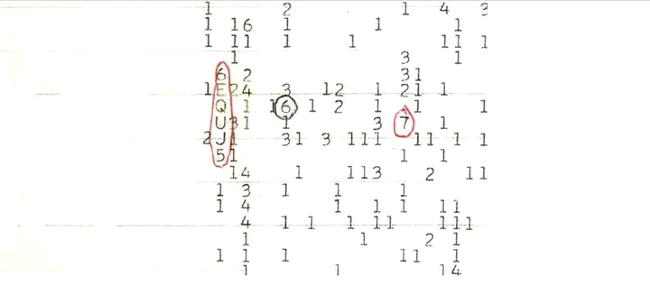

# 🧠 AI Neural Network Analysis: Decoding the 'Wow! Signal' Grid

This repository demonstrates how a modern Artificial Neural Network (ANN) processes, detects, and decodes abstract visual data. The analysis is based on an uploaded image containing a cryptic matrix of numbers and letters, famously known as the **1977 Wow! Signal** printout.

---

## 🚀 How the AI Neurons Processed the Image (Step-by-Step Script)

When the image was inputted into the model, the artificial brain executed a multi-layered processing sequence to move from raw pixels to semantic understanding.

### 🌐 Step 1: Input Layer (Raw Pixel Reception)
* **Action:** The initial layer receives the raw pixel data ($RGB / Grayscale$ matrix).
* **Process:** No meaning is assigned yet. The neurons simply map out the bright white background contrast against the dark ink strokes and notice the shift in color channels where red ink appears.

### 🔍 Step 2: Convolutional Layers (Feature Extraction)
* **Action:** Edge and shape detection via CNN (Convolutional Neural Network) kernels.
* **Process:** * Neurons detect vertical alignments and circular contours.
  * The network highlights regions of interest (ROIs), specifically focusing on the hand-drawn red oval and the two circled characters.

### 🔠 Step 3: OCR & Object Detection (Character Recognition)
* **Action:** Decoding old dot-matrix printer fonts into digital characters.
* **Process:** The network segments the isolated pixels and identifies the vertical sequence:
  $$\mathbf{6} \rightarrow \mathbf{E} \rightarrow \mathbf{Q} \rightarrow \mathbf{U} \rightarrow \mathbf{J} \rightarrow \mathbf{5}$$
  It also registers the isolated circled numbers: a black-circled **6** and a red-circled **7**.

### 💡 Step 4: Deep Hidden Layers (Semantic Linkage & Memory Retrieval)
* **Action:** Cross-referencing the decoded sequence with the global knowledge base.
* **Process:** * The weights and biases shift as the network asks: *"Where in human history does the pattern `6EQUJ5` exist alongside a grid of numbers?"*
  * **The Hit:** The network triggers a strong connection to August 15, 1977—the day Ohio State University's *Big Ear* radio telescope received a powerful narrowband radio signal from outer space. 

### ✍️ Step 5: Output Layer (Natural Language Generation)
* **Action:** Converting mathematical matrix outputs into human-readable text.
* **Process:** The final layer triggers the Language Model (LLM) to translate the high-dimensional data into a well-structured, empathetic, and clear explanation in the user's preferred language (Bengali).

---

## 📊 Summary of Identified Keypoints

| Feature | Detected Element | Historic Significance |
| :--- | :--- | :--- |
| **Red Oval** | `6EQUJ5` | The alphanumeric code representing the intensity of the Wow! Signal. |
| **Black Circle** | `6` | An isolated peak intensity marker on the telemetry grid. |
| **Red Circle** | `7` | Another high-intensity frequency reading flagged during human review. |

---
*Note: This repository serves as a conceptual breakdown of Computer Vision (CV) and Large Language Model (LLM) collaboration.*
